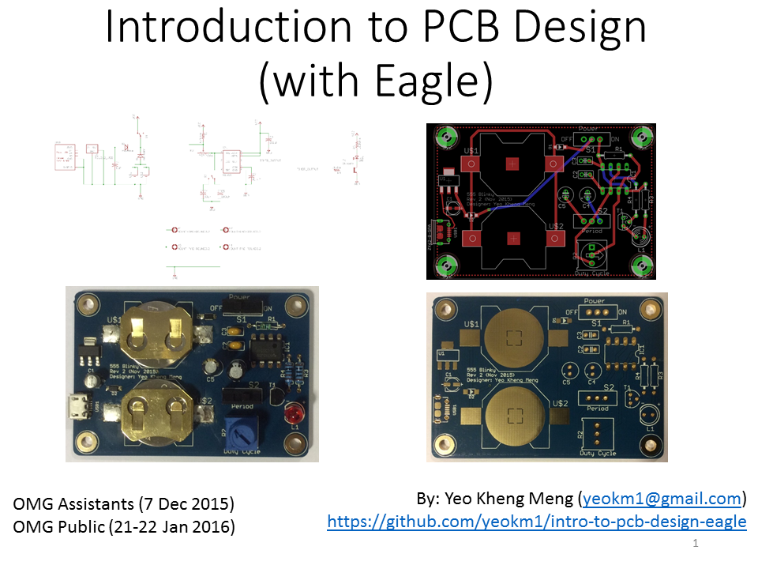
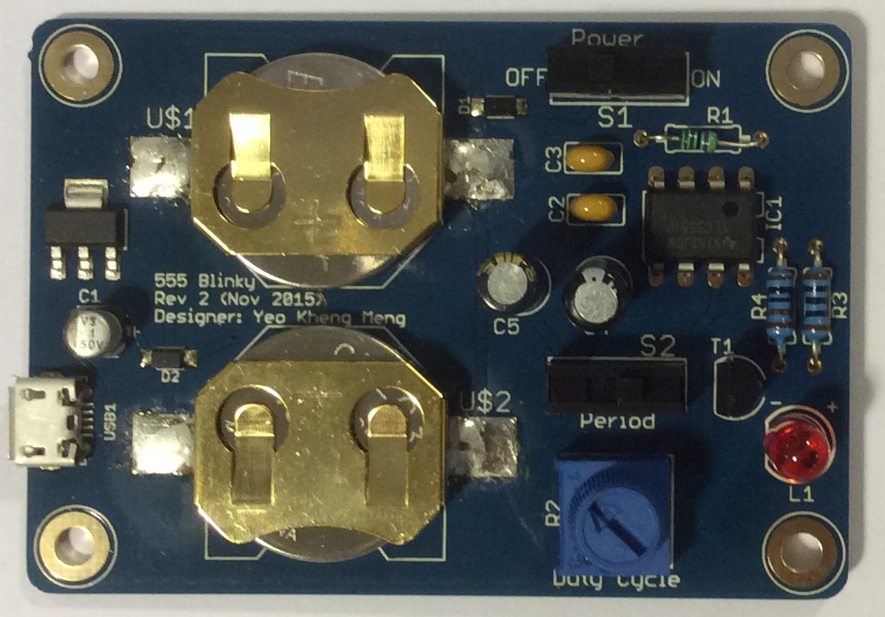
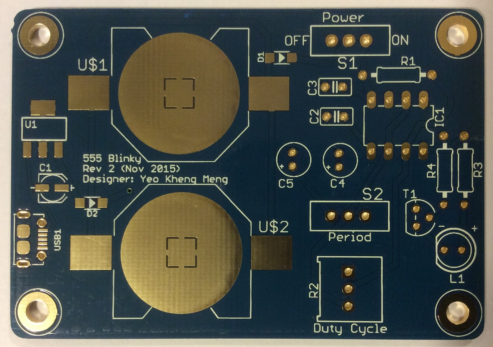
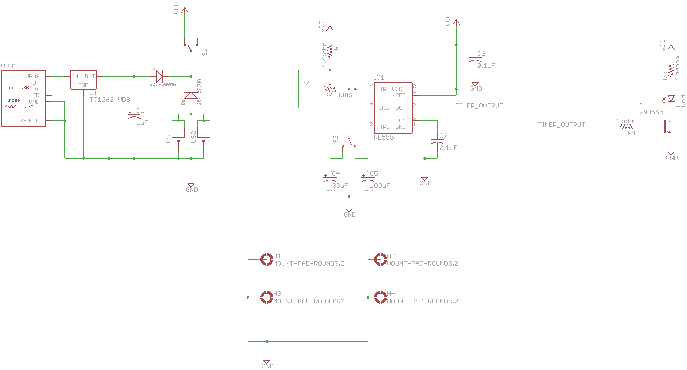
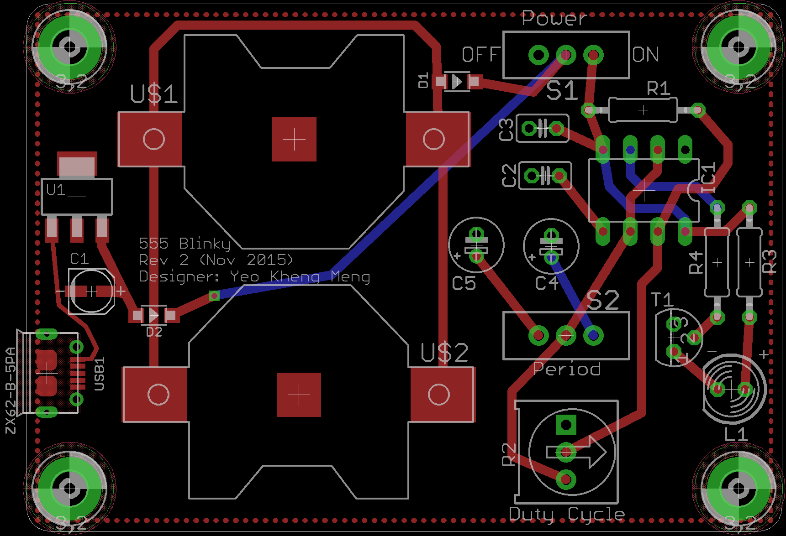

# intro-to-pcb-design

A class to introduce students to designing Printed Circuit Boards (PCBs) using the Eagle software. The PCB that will be designed is based on a 555 Timer circuit. Reflow soldering with stencil and solder paste will also be covered. 

The lesson should take approximately 6 hours to complete.

My slides are available on slideshare using the picture link below.

#Images

Reference PCB with all components populated.

Bare PCB

Reference schematic

Reference board

#Parts/Equipment Required
1. PCB bill-of-materials (BOM) can be obtained from the [555-blinker-bom.ods spreadsheet](555-blinker-bom.ods)
2. Soldering iron
3. Reflow oven or hot-plate

#PCB Design software and addons/references used

1. Eagle 7.5.0: I use Standard but Light should still be able to open/modify the files.
2. Modified CR2032 library based on [here](https://github.com/nickaknudson/eagle-nickaknudson/blob/master/cr2032.lbr)
3. Elecrow Design Rule Check for 2 layers (in repo as `Elecrow_2-layer_eagle_rule.dru`)
4. Elecrow Gerber Generater 2-layer board (in repo as `Elecrow_Gerber_Generater_DrillAlign.cam`)
5. [Seeed OPL libraries](http://www.seeedstudio.com/wiki/File:OPL_eagle_library.zip)
6. [Sparkfun Electromechanical](https://github.com/sparkfun/SparkFun-Eagle-Libraries/)
7. [bt_regulator](https://github.com/shimniok/eagle-library/blob/master/bt_regulator.lbr)
